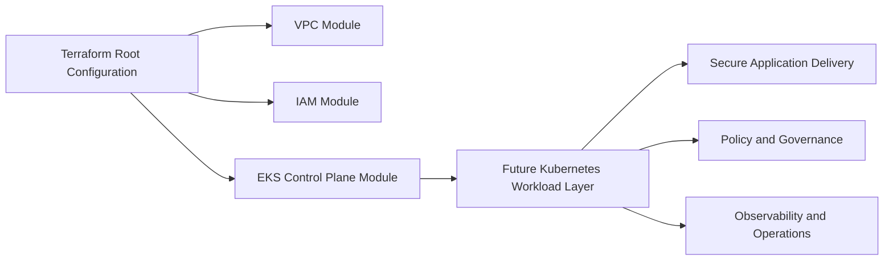

# Architecture

ClusterShield360 is evolving from a Terraform-first infrastructure repository into a secure Kubernetes platform foundation for resilient digital service delivery.

## Current Architectural Pattern

- Terraform provisions baseline AWS networking, IAM, and the EKS control plane
- modules isolate infrastructure concerns for reuse and readability
- root configuration assembles those modules into a single deployment entry point
- platform-layer directories are scaffolded separately so future Kubernetes assets can be added without conflating design intent with implemented capability

## Transition Direction

The intended evolution is to keep Terraform responsible for foundational cloud resources while adding carefully scoped platform layers for Kubernetes operations, workload delivery, and security controls.

## Target End State

Over time, the repository can mature toward a structure where:

- Terraform provisions foundational AWS infrastructure and cluster prerequisites
- the `k8s/` tree contains real namespaces, workloads, services, ingress, and security assets
- `gitops/`, `monitoring/`, and `cicd/` hold operational layers only when those implementations exist
- security controls are layered in as real implementations rather than documentation-only claims
- operations patterns such as validation, policy checks, and observability are introduced incrementally

## Design Principle

The project should stay honest about maturity: infrastructure first, platform controls next, then operational hardening. Each layer should be visible in version control only when the implementation actually exists.
